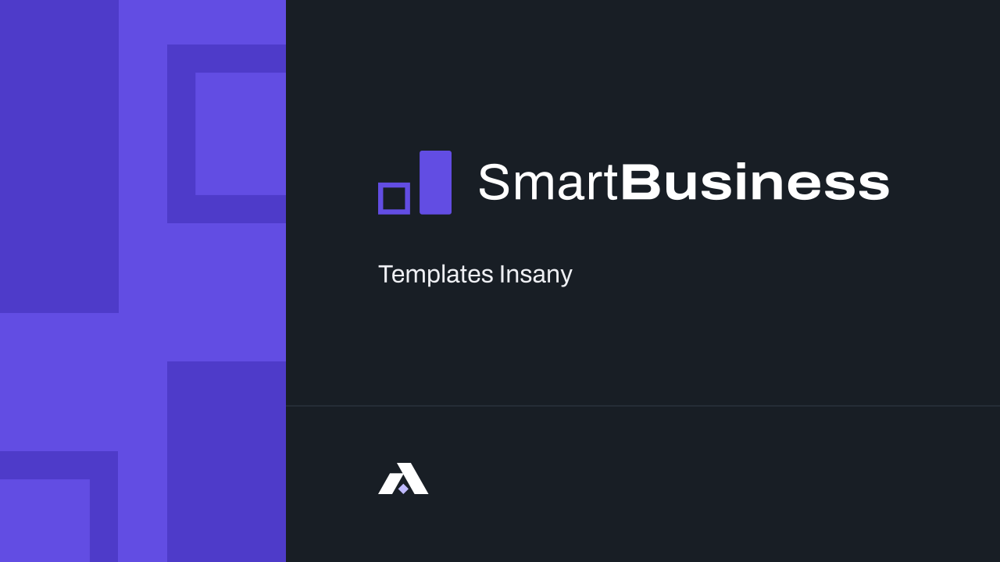

# 💸 Insany Bank - Landing Page

Este é um projeto desenvolvido com [Next.js](https://nextjs.org) e tipado com [TypeScript](https://www.typescriptlang.org/) como parte do **Desafio Front-End da Insany**.  
O objetivo foi desenvolver uma Landing Page para um banco digital, com foco em responsividade, animações, performance e consumo de API.



---

## 🔧 Tecnologias e Ferramentas

- **Next.js + TypeScript**
- **Styled-Components**
- **Framer Motion**
- **Context API**
- **Sanity CMS**
- **WordPress REST API**

---

## ✅ Funcionalidades

- Captura de leads com validação de campos
- Integração com API REST do WordPress
- Pages dinâmicas via `getStaticPaths` + `getStaticProps`
- Estado global com Context API
- Animações com Framer Motion
- Responsividade mobile-first
- Estrutura de código modularizada

---

## ▶ Getting Started

Primeiro, instale as dependências:

```bash
npm install
# ou
yarn install

->

npm run dev
